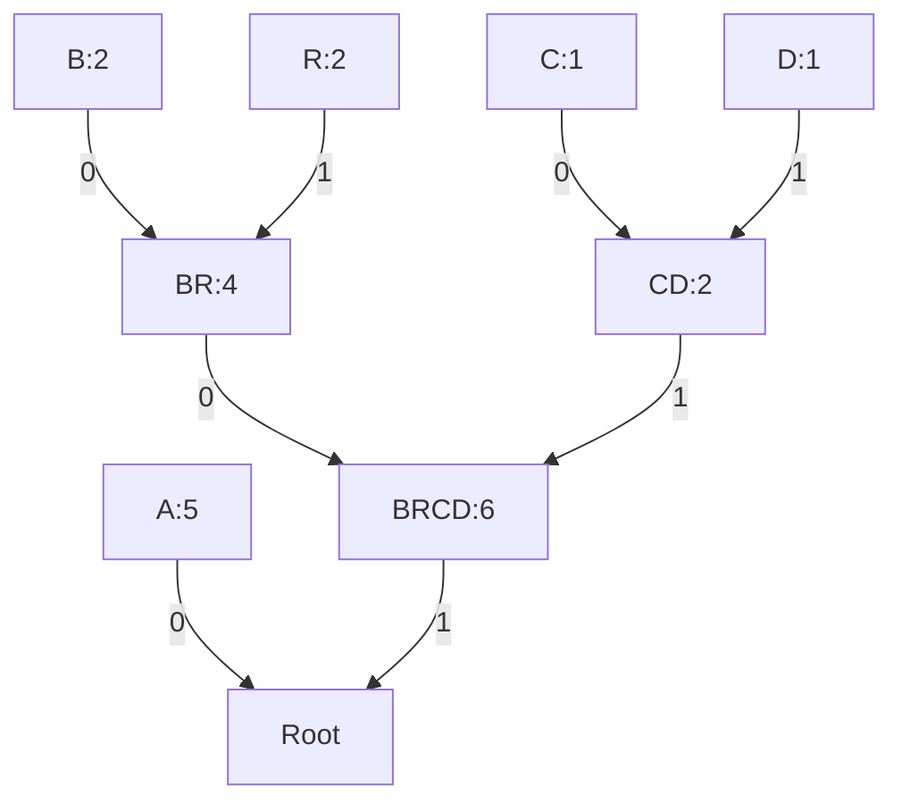

# Huffman Coding Analysis for "ABRACADABRA"

## 1. Character Frequency Analysis

| Character | Frequency |
|-----------|-----------|
| A         | 5         |
| B         | 2         |
| R         | 2         |
| C         | 1         |
| D         | 1         |

## 2. Huffman Tree Construction



## 3. Huffman Code Assignment

| Character | Huffman Code |
|-----------|--------------|
| A         | 0            |
| B         | 100          |
| R         | 101          |
| C         | 110          |
| D         | 111          |

## 4. Size Calculations

### Original Size (ASCII)
```
11 characters × 8 bits/character = 88 bits
```

### Compressed Size (Huffman)
```
A: 5 × 1 bit = 5 bits
B: 2 × 3 bits = 6 bits
R: 2 × 3 bits = 6 bits
C: 1 × 3 bits = 3 bits
D: 1 × 3 bits = 3 bits
Total = 5 + 6 + 6 + 3 + 3 = 23 bits
```

## 5. Compression Results

| Metric            | Value       |
|-------------------|-------------|
| Original Size     | 88 bits     |
| Compressed Size   | 23 bits     |
| Compression Ratio | 73.86%      |
| Space Savings     | 65 bits (73.86%) |

> **Note:** The Huffman tree representation would add approximately 10-15 bits of overhead in a real implementation.
